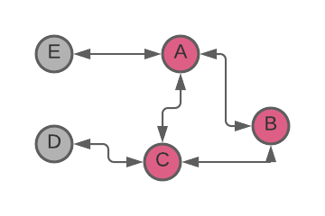
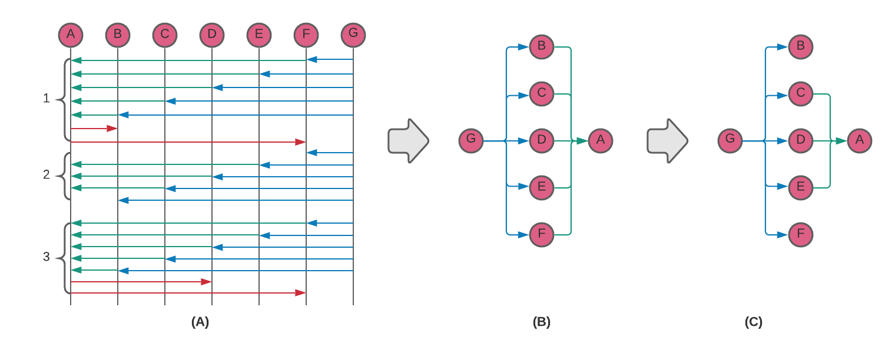
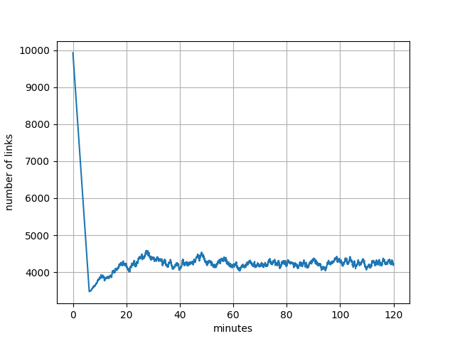

# Message Routing Optimizations, Pt. 1: Proposal & Validation Relaying

_by Gregory Tsipenyuk and Nikolaos D. Bougalis of Ripple_

Like all peer-to-peer networks, the XRP Ledger needs a strategy to ensure that messages are propagated across the network. Of course, some types of messages are more important or more time-sensitive than others, so the XRP Ledger uses different strategies for relaying different types of messages.

This blog post discusses the message propagation strategy used for “proposal” and “validation” messages, which are part of the [consensus protocol](https://xrpl.org/consensus.html), and the improvements that the RippleX team researched and is contributing.

<!-- BREAK -->

## Current System

Currently, the XRP Ledger uses [flooding](https://en.wikipedia.org/wiki/Flooding_%28computer_networking%29) to propagate proposal and validation messages; in other words, when a server receives a proposal or validation message, that server passes it on to all of its peers except the one it got the message from initially. A proposal message contains a set of candidate transactions and a proposed close time for the next ledger, while a validation message contains information about the ledger built by applying a set of proposals.

Flooding protocols are generally reliable in propagating messages throughout the network since they naturally utilize every path. However, they can also be inefficient, especially in densely connected networks, where they can increase bandwidth usage dramatically and impose additional work on the servers that must process those messages..

For example, in the graph below, if _A_ sends a message to _B_ and _C_, the flood algorithm might result in both _B_ and _C_ sending the message to each other. Unfortunate timing may even make it possible for one of them to even send the message back to _A_, which originated it (Figure 1).

> 
>
> _Figure 1. Redundant message propagation from node A to node B_

While this example is a hypothetical scenario, we felt that the impact of redundant message propagation on the XRP Ledger network could be substantial, so we collected and analyzed data in an attempt to better understand the scope of the problem.

## Initial Research and Approach

We crawled the XRP Ledger main network with [Peer Crawler](https://xrpl.org/peer-crawler.html) and collected the number of peers for each reachable node: we discovered a total of 759 reachable nodes and 9,926 links between the nodes. About 73% of the nodes have more than 10 peers, 10% have more than 50 peers, and 6% have more than 200 peers. The highest number of peers we detected was 238.

We also used the [get_counts](https://xrpl.org/get_counts.html) API method on a Ripple-operated node connected to the XRP Ledger mainnet, to determine the frequency of various message types. We discovered that, during the sampling period, proposal and validation messages accounted for 72% of the 42 million messages.

These percentages are not unexpected and confirmed the theory that the propagation of proposal and validation messages has a significant impact on the bandwidth usage of individual nodes and the network as a whole, and that message duplication likely has a measurable impact on the performance of the network as a whole.

We are proposing to mitigate the load on the network by optimizing the relaying strategy for proposal and validation messages by limiting transmission of duplicates, resulting in a net reduction of the number of messages relayed.

## How It Works

The proposal, previously [outlined on xrpchat.com](https://www.xrpchat.com/topic/33075-suggestion-reduce-relaying/), accomplishes this by allowing a server to select a subset of its peers to function as the source of proposal and validation messages from a specific validator and suppressing the messages from the rest of its peers by sending a “squelch” message to them.

This process should work well because, generally, the flooding protocol utilizes all paths throughout the network equally, and since some paths will be “shortest” or “fastest” in the sense that they consistently deliver the message from a particular validator faster than others we can identify the peers with the lowest latency and select them as a preferred source of the proposal and validation messages.

The node uses the number of messages received from each peer to make a short list of peers who've sent a good number of messages. Then it randomly chooses some of those peers to be its preferred source of validation and proposal messages. To everyone else, the node sends a "squelch" message, telling them not to relay certain messages to it for a while.

More specifically, the “squelch” message tells a peer to suppress messages originating from a certain validator (identified by a public key) for a given amount of time. After the duration expires, the peer starts relaying messages downstream (Figure 2).

When the node gets a message from a new peer, or receives a message from a peer whose squelch duration has passed, that node restarts the peer selection process. Similarly, if a selected peer disconnects, then the node sends an “un-squelch” message to all squelched peers requesting that they resume relaying messages, then restarts its peer selection process.

This mechanism allows to adjust the peer’s selection process to changes in the network topology. Note that a node maintains a record of the squelch duration for each squelched peer and doesn’t start the selection process if a message from a squelched peer is received too soon.

This process is further demonstrated on a sequence diagram in Figure 2(A). Node  _G_ propagates validation and proposal messages from a validator to nodes _B_  through _F_ (blue arrows) via some route (1).

> 
>
> _Figure 2. Relay Reduction concept sequence diagram and graph visualization._

Nodes _B_ through _F_ are peers of node _A_ and relay the messages to node _A_ (green arrows). Consequently, node _A_ receives each message 5 times. As node _A_ receives the messages from its peers, it determines that messages from nodes _C_, _D_, and _E_  arrive sooner than from the rest of the peers.

Node _A_ selects these peers as the source of the messages from the validator and sends a “squelch” message to nodes _B_ and _F_ (red arrows). Node _G_ keeps on relaying the messages to nodes _B_ through _F_ but only nodes _C_, _D_, and _E_ relay the messages to node _A_ (2).

At some point, nodes _B_ and _F_ un-squelch and start relaying the messages to node _A_. Node _A_ determines this time that nodes _B_, _C_, and _E_ should be the source of the messages from the validator and sends squelch messages to nodes _D_ and _F_ (3).

This is further visualized as a graph on Figure 2 (B, C) where graphs (B) and (C) correspond to sequence (1) and (2) respectively. We can see that the relay reduction algorithm reduces the number of down-links to A by 2. As demonstrated in the Results section below, the reduction in links, when scaled up to the main network, is significant.

However, as can be seen from Figure 2(C), node _A_ still receives 3 redundant messages. In an ideal network topology a broadcast tree is formed in such a way that each node receives a unique message only once. This topology can be represented as a subgraph or a [spanning tree](https://en.wikipedia.org/wiki/Spanning_tree), which has every node (vertex) covered with a minimum possible number of links (edges).

> 
>
> _Figure 3. Pros and cons of a spanning tree broadcast._

Consider a message propagation in a network represented by a directed graph in figure 3(A). A simulated message propagation via Breadth First Search (BFS) from a vertex _A_ through the graph forms the following paths: 1) _A→C_, _A→E_, _A→F_; 2)  _C→D_, _C→E_; 3) _E→B_; 4) _F→B_, _F→D_; 5) _D→B_. All together there are 9 edges in the graph and as can be seen, vertices _B_, _D_, and _E_ have multiple incoming edges; i.e. receive the message from _A_ redundantly 3, 2, and 2 times respectively. If we form a spanning tree by selecting one random incoming edge in each node then it forms a graph in Figure 3(B). This graph has 5 edges; i.e. a number of redundant messages is reduced by 45%.

This topology is optimal in an ideal network with no failures. But in a real crypto network where links and nodes can experience arbitrary byzantine failure, this topology loses resilience and reliability. Indeed, if a link _C→E_ fails then nodes _E_ and _B_ are not going to receive the message as shown in Figure 3(C). If on the other hand we select two random incoming edges in each node then node  _E_ can receive the message via link _A→E_ as shown in figure 3(D). Other failures are still possible in this hypothetical network since nodes _C_ and _F_ have only one incoming edge; i.e. there is no redundancy.

There are some strategies where an optimal broadcast tree can be constructed with the flooding used for fast recovery in case of failures as described in the [Epidemic Broadcast Tree](https://core.ac.uk/download/pdf/32330596.pdf) research paper.  We are collaborating with University of Luxembourg researchers to investigate how other overlay optimization strategies can be applied.

### Validating This Proposal

To prove the validity of this proposal, we modeled the XRPL network as a [directed graph](https://en.wikipedia.org/wiki/Directed_graph) and demonstrated that the graph remains connected when “squelched” edges are removed and that there is a substantial reduction in relayed messages.

A network node is represented by a vertex and a connection between two nodes in the network is represented by two directed edges connecting the nodes in the opposite direction. The directed edges model the message propagation within the network.

To model the peer squelching, for each vertex in the graph we randomly select 5 neighbors, and for the rest of the neighbors, remove the incoming edges. The resulting graph is a snapshot of a message propagation path from a node to all other nodes.

Note that the resulting paths are not the optimal paths since the source upstream vertices are selected at random. It is expected that on a live network the paths would be better optimized since the peers are selected using latency as the selection criterion.

We took 100,000 snapshots of the graph constructed this way. For each snapshot we recorded:

* if the graph is weakly connected;
* a number of nodes in the largest strongly connected component;
* if remaining nodes have an incoming edge from the component; and
* a number of undirected edges.

## Results

The graph remains weakly connected in every snapshot. On average there are 465 nodes in the largest strongly connected component, all remaining nodes have an incoming edge from the component, and on average there are 3,477 edges in the component.

There are two important findings in the results. First that the remaining nodes have an incoming edge from the component. If a node is the originator of a message, a validator in the XRPL network, then it ignores the squelch request and relays the message to all its peers.

Consequently, if a remaining node is a message’s originator, then the message will be propagated to the strongly connected component, and from the strongly connected component, it can be propagated to any of the remaining nodes. If a node in the strongly connected component is a message’s originator, then the message can be propagated to all remaining nodes. Therefore, a message originating at any node within the graph can be propagated to any node.

Second, while the reduced graph retains its ability to propagate a message throughout the network, it has 2.8 times less edges, which may result in significantly less redundant messages propagated throughout the network.

Note that a snapshot represents an optimally reduced graph in that it has all non-source vertices squelched at the same time. In the real network, the vertices/nodes are squelched and un-squelched at a random time resulting in a higher average number of edges.

We can model this by introducing a timeline to the graph where each vertex selects 5 neighbors at random and squelches the rest for a random duration. When a neighbor is squelched, the incoming edge is removed. When a neighbor is un-squelched, the respective incoming edge is added back.

Each change in the number of edges is recorded in the timeline. We simulated 120 minutes of this process. The result is shown on Figure 4.

The network starts in a normal mode with 9,926 links. After about 5 minutes all vertices squelch their redundant neighbors, resulting in a significant reduction of links. As neighbors start to randomly squelch and un-squelch, a number of links averages at 4,210 with standard deviation 157. The reduction in links in this case is 2.4-fold.

> 
>
> _Figure 4. Model of a number of links over time._

Validating the Results  To collect information, we instantiated a testnet with 40 nodes, 10 of which were configured as validators; each node had 20 peers. We conducted several one-hour runs of this network, both with and without the “reduce relay” feature. The results are shown in Table 1.

The reduction in a number of messages and size is about 2.76 fold, which is within the estimated range of reduction 2.4-2.8 fold. Bandwidth savings in this case is about 528K/sec.

| Metric       | Relay Reduction disabled | Relay Reduction enabled | Reduction |
|:-------------|:-------------------------|:------------------------|:----------|
| Count        | 15,628,604               | 5,653,278               | 276%      |
| Size (bytes) | 2,979,290,492            | 1,077,290,776           | 276%      |

The expected bandwidth savings across the entire XRP Ledger main network from applying the relay reduction feature can be estimated using data from the model and information collected from the main network, and works out to approximately ~1MB/sec per validator.

## Key Takeaways

Modeling and testing of the relay reduction feature demonstrate that it is effective at reducing the amount of proposal and validation messages can be reduced roughly by 2.5 times without affecting message propagation.

These results are incredibly exciting and will help make the protocol more efficient. We hope to see other node operators test the relay reduction enhancement, and validate the results.

In the meantime, we will continue research improvements in message routing, focusing especially on the routing of transaction messages. Unlike proposals and validations, which only originate from nodes configured as validators, transactions can originate at any node and that necessitates a different approach. We hope to outline the thinking and provide more details on this topic in an upcoming blog post.