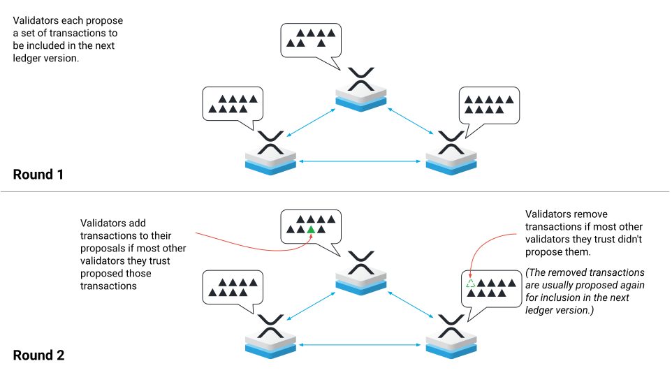

# Validation

The core principle behind the XRP Ledger's consensus mechanism is that a little trust goes a long way. Each participant in the network chooses a set of _validators_, servers specifically configured to participate actively in consensus, run by different parties who are expected to behave honestly most of the time. More importantly, the set of chosen validators should not be likely to collude with one another to break the rules in the exact same way. This list is sometimes called a _Unique Node List_, or UNL.

As the network progresses, each server listens to its trusted validators; as long as a large enough percentage of them agree that a set of transactions should occur and that a given ledger is the result, the server declares a consensus. If they do not agree, validators modify their proposals to more closely match the other validators they trust, repeating the process in several rounds until they reach a consensus.

It does not matter if a small proportion of validators do not work properly every time. As long as fewer than 20% of trusted validators are faulty, consensus can continue unimpeded; confirming an invalid transaction would require over 80% of trusted validators to collude. If more than 20% but less than 80% of trusted validators are faulty, the network stops making progress.

For a longer exploration of how the XRP Ledger Consensus Protocol responds to various challenges, attacks, and failure cases, see [Consensus Protections Against Attacks and Failure Modes](consensus-protections.html).